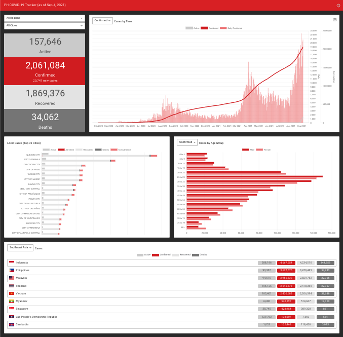

# PH COVID-19 Tracker

This project provides timely information of COVID-19 cases in the Philippines.

## Preview

[Live Demo](https://covid19ph-tracker.herokuapp.com)

## Prerequisites

### Caching

This application uses Redis to cache the query results from the server.  Please make sure you have Redis installed and running.  Check [Redus Quick Start](https://redis.io/topics/quickstart) for more information.

### Data Source

This application connects to MongoDB Atlas to retrieve the cases.  You can sign up for a free shared cluster in [MongoDB Atlas](https://www.mongodb.com/atlas). Create your database and take note of the connection string. Download the *COVID-19 DOH Data Drop* from *COVID-19 Tracker* of the [Department of Health](https://doh.gov.ph/) and import the data to your cluster.

## Run

Set the following environment variables:

In Windows,

    `SET REDIS_URL=redis://localhost:6379`
    `SET DB_CONNECTION=mongodb+srv://[username:password@]server.example.com/`

In MacOS or Linux,

    `export REDIS_URL=redis://localhost:6379`
    `export DB_CONNECTION=mongodb+srv://[username:password@]server.example.com/`

To start the server, run `node server/server.js`.

To start the UI in the development mode, run `npm run start:dev`.

Open http://localhost:3001/.

## Build

To build the project for production, run `npm run build`.
